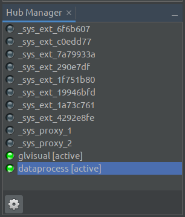
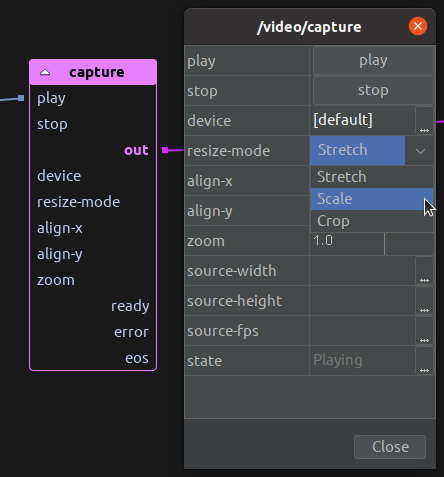

# Architecture & terminology

## A forest not a tree

_PraxisCORE_ has its own Forest-of-Actors architecture for distributed and concurrent programming.
The strict adherence to this allows for easy working with multiple pipelines. It provides the
ability to safely background load resources, process data, or replace running code without
interfering with real-time processing. And it allows for projects to transparently run across
multiple processes (for better performance) and/or multiple devices.

Individual components exist within a tree, which can be multiple levels deep. All components have an address, which
follows a familiar slash-separated syntax (eg. `/data/filelistener`). The first level of this tree is a special
type of component called a **Root**. Roots generally provide the overall context and scheduling for their child
components.

There are currently 7 types of root available within a standard _PraxisLIVE_ install - a generic (data) root, and
specialist roots for video (OpenGL visualization), audio (DSP), GUI, OSC, MIDI and TinkerForge hardware. While you
might commonly have one of each type you require, it is possible to have as many roots of as many types as your
system(s) can handle.

All roots exist within a **Root Hub**. The root hub is a container for roots, but it is not itself a component.
All roots are sand-boxed from each other – there is no way for any root or component within it to directly access
another root or its components. Instead, the hub acts as a router to pass messages between different roots, local
or remote.

The **Hub Manager** within _PraxisLIVE_  gives you a visual representation of the root hub.
You will notice that there are 2 user roots running, and that the button is toggled to
also show you the system roots - all of the system code is equally sand-boxed and confined to using the
message-passing system.

## Ports & controls

Components within _PraxisCORE_ have two ways of communicating – **Ports** and **Controls**. Ports are used for
synchronous communication with sibling components (share the same parent). When you connect components by drawing
lines in the _PraxisLIVE_ graph editor, you are connecting ports together. They are a lightweight mechanism
for sharing control data, OpenGL textures, audio buffers, etc. Ports also have an address
(eg. `/video/capture!out`).

Controls are the basis of _PraxisLIVE’s_ message-passing system. They receive, react and respond to messages 
usually coming from a component within another root. All communication _without exception_ between components in
different roots ends with a control receiving a message. Controls have an address consisting of their component
address and ID (eg. `/video/capture.play`) – the dot syntax is a deliberate parallel with method calls.

Above you can see an example of a `video:capture` component in the editor. Ports can be seen on the graph component
and controls within the component editor window – note that many controls will have a corresponding port.

When you manipulate values within the dialog, you are sending messages to controls on the component. There are
three different types of controls – actions, properties and functions. Actions (buttons) and properties can be
seen in the table. Functions are not fully reflected within the editor, and are primarily used internally.

The `ready` and `error` output ports reflect the fact that some things may happen asynchronously, or may fail. A
robust project will normally use these signals to trigger suitable actions in either case.

## Further information

Additional information on the architecture of PraxisCORE can read in the blog posts 
[A Forest of Actors](https://www.praxislive.org/blog/a-forest-of-actors/) and
[Just-in-Time Programming](https://www.praxislive.org/blog/just-in-time-programming/).
