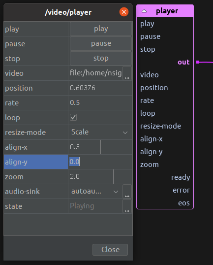
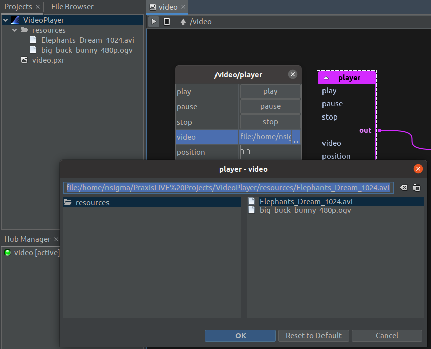

# Component editors

This image shows the editor dialog opened by double-clicking on a component, in this case a
`video:player`. It mirrors what you will see in the `Properties` tab if you select a
component.

At the top of the editor are buttons for action controls defined by the component, here for
playing, pausing and stopping playback. These actions are also accessible from the pop-up menu
of the component itself.

Below the actions are other properties. You can change individual values by clicking on the
value cell with the mouse and entering the new value. You can also use the arrow keys on the
 keyboard to move between different values – click `SPACE` to highlight and edit a value.
Type the new value and press `ENTER` to change – if you change your mind you can also us
`ESCAPE` to revert. The pop-up menu on each value also gives the option to revert to the
default value of that property.

Numeric values that have a defined range (eg. `align-x`) have a vertical line that represents
the current value. You can also change these values by clicking and dragging the mouse within
the value cell, just like you would use a slider. A short click still works to highlight the
cell to edit by text.

Properties marked in italics (eg. `position`) are transient. This means that although you can
control these properties, the value is not saved when you save the file. Transient is used for
cases where it is unlikely you want to save the current value, maybe because it is continuously
changing.

## Extended editors

Some properties have the ability to open an extended editor – this is represented by the ellipsis
button at the right of the value cell. Clicking on this button will open an extended editor dialog.
Other properties may open the extended editor whenever you try and edit them.

This image shows the file chooser that shows up when selecting a file for the video player. Note
that the files shown are from the `resources` folder of the project by default. Use the browse
icon at the top right to select a file from elsewhere on your system.

Depending on the type of the property, there may be more than one extended editor available.
A select box will appear at the top right of the extended editor window to allow you to choose
which extended editor to use. Alternative extended editors usually reflect functions available
within the underlying scripting language.

