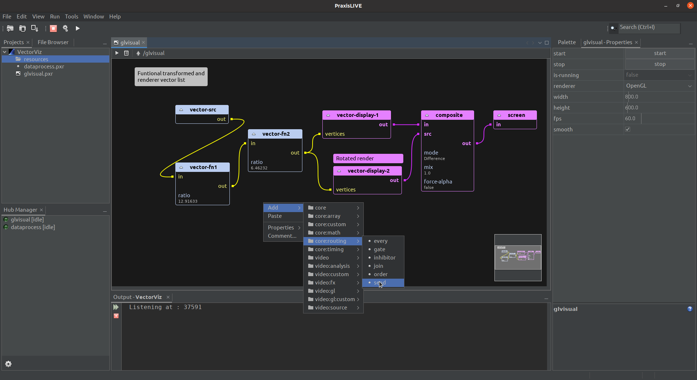

# Graph editor

The default editor is the graph editor, used for audio, video, tinkerforge, and generic data pipelines. Components
and port connections are represented in a graphical node form that should be familiar to anyone who has used other
visual dataflow environments.

## Creating and connecting components

To **add components**, drag the component type you want from the `Palette` window onto the editor, or use the pop-up
menu browser. Components are automatically filtered depending on the root type. You will be asked to name the
component (a unique name will be suggested) – _names cannot be changed once the component is created_.

To **connect ports**, click and drag with the mouse between the two ports. You cannot connect ports of incompatible
types, and output ports can only be connected to input ports. Connections are colour-coded depending on type.

Components and port connections can be removed by selecting them and pressing `Delete` or selecting delete from the
pop-up menu.

Selected components may be moved around by dragging with the mouse, or using the cursor keys. Selected components
may also be copy & pasted. Multiple components can be selected by clicking and dragging a selection box around
them, or by `CTRL-clicking` on each component.

**Zoom in and out** of the graph using `CTRL-mousewheel`, and **navigate** around using the scroll wheel or
satellite view in the bottom-right of the editor.

You can add **comments** to individual components or to the graph window from the pop-up menu. Comments on
components will remain attached to the component when moved.

## Component properties and actions

Double-click on the component to open the component editor window to access actions and properties. Component
actions are also accessible through the pop-up menu on components. When selected, component properties also
show up in the `Properties` tab – if multiple components are selected you can use this tab to control all of
them together.

## Containers

Double-clicking on a container will open it inside the editor. To return to the parent graph, use the up
arrow in the editor toolbar, or press `ESC`.

When inside a container you can use the pop-up menu on any port as a shortcut for adding the port
to the parent port map. Renaming, rearranging or deleting ports still needs to be done from the
parent ports property.

Graph comments inside a container will show (up to the first double line break) as component
comments in the parent graph.

## Keyboard control

Much graph editing can be accomplished using the keyboard.

### Graph Actions

The graph keyboard actions support adding components, selecting components, calling properties/actions,
and making/breaking connections. Actions appear in a bar at the bottom of the graph window, and are
triggered by keys based on the syntax of the Praxis Command Language used in the terminal and in project
files. Fields have an auto-complete list (trigger by typing or down-arrow), and most support glob syntax
for multiple selection. `TAB` between fields, use `RETURN` to action, or `ESC` to close the action.

- `@` - Add a new component. Suggest field of components from palette. Components currently appear
in the same location - use arrow keys to move.
- `/` - Select component(s). Single text field with suggestions and glob support (eg. use `*` to
select all).
- `.` - Call action / change property. Selected component will be pre-filled but can be changed.
Control field lists available controls. For properties, value field will show current value. Component
field supports glob syntax, so same control on multiple components can be changed in one action.
- `~` - Connect component ports. Fields are source component, source component output, destination
component, and destination component input. All fields support glob syntax for making multiple connections
in one action. Multiple ports are cycled - eg. `out*` and `in*` will connect `out-1` to `in-1` and
`out-2` to `in-2`.
- `!` - Disconnect component ports. Fields as above. Destination is pre-filled with `*`.

### Other keyboard shortcuts

- `RETURN` - open component editor or container.
- `ESC` - exit component editor or container.
- `SHIFT-RETURN` - open code editor.
- `DELETE` - delete selected component(s) or port(s).
- `TAB / SHIFT-TAB` - change the selected component.
- `ARROW KEYS` -  move the selected component(s).
- `CTRL/CMD-C` - copy the selected component(s) - make sure to wait for sync to complete.
- `CTRL/CMD-V` - paste component(s).
- `CTRL/CMD-D` - duplicate component(s) - equivalent to copy & paste with wait for sync.
