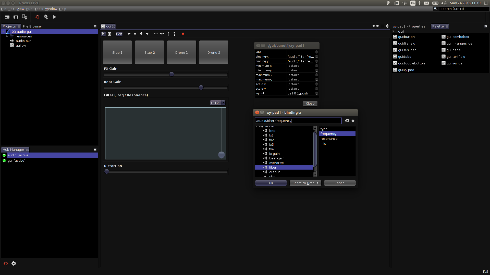

# GUI (control panel) editor

When you open a GUI / control panel `.pxr` file it will open in the GUI editor.
If the GUI was open (running), the external window will be closed and the panel
“hijacked” into the editor. The control panel is still fully functional inside the
editor.

To make changes to the control panel you need to enable the edit overlay. Toggle
the `Edit` button in the editor toolbar (or use `CTRL-e`). Component boundaries
will now highlight as you hover over them and you can select component by clicking
on them. Switch off the edit overlay (using the same button / keys) to re-enable
use of the control panel.

**Add components** to the control panel by dragging them from the palette (the edit
overlay must be enabled). You can insert components by dropping them on top of
existing components. Unlike the graph editor, the GUI editor gives all components an
automatic name.

**Edit component properties** by double-clicking on them to open the component editor
window, or selecting them and using the `Properties` tab. The GUI editor does not
currently support multiple select.

Components are organised in a grid / table. You can move selected components around
the panel by using the arrow buttons in the editor toolbar or the arrow keys on the
keyboard. It is possible for components to span multiple rows or columns of the grid,
using the buttons in the toolbar or holding `CTRL` while using the arrow keys.

To **bind a GUI component** to a property of another component, use the `.binding`
property - you may enter a control address manually or use the address browser
(ellipsis button) to search through existing components. GUI components will attempt
to configure themselves from the binding – eg. a slider with no minimum / maximum
value overrides will use the minimum / maximum values of the bound control. When
bound to a property control, GUI components will automatically sync.

**Remove components** by selecting them and using the `Delete` key or the delete
button on the editor toolbar.