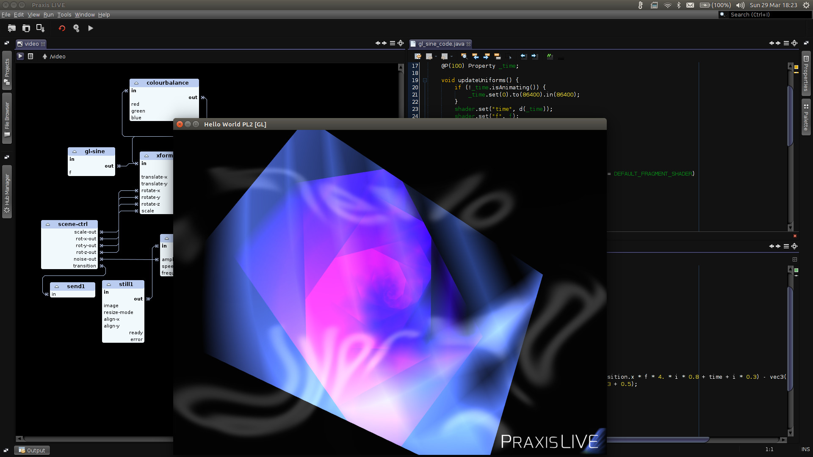

**Documentation in development**

Praxis LIVE is a hybrid visual IDE for live creative coding.

_easily create projections, interactive spaces, custom VJ tools, sonic performance instruments, live media for theatre; use it as a live digital sketchbook, test out ideas, experiment with code_

It's free, cross-platform and open-source. Download from [www.praxislive.org](http://www.praxislive.org)

## Primary Features

* **Media neutral architecture**. Built from the ground up for working with multiple media, using an architecture based around models for distributed processing.
* **Intuitive patcher-style graphical editor**. Fast visual project building with drag-and-drop creation of components and connections.
* **Edit everything live**. Built around the central concept that everything should be editable at run time.
* **Optimized video pipeline**, including a range of pixel effects and blend modes, with software and OpenGL rendering.
* **Low latency audio support**, including JACK binding.
* **Custom GUI's and MIDI/OSC control**. Create custom controls panels bound to any parameter, or control any parameter using a MIDI or OSC controller.
* **Live coding**. For when the built-in component don't offer all you need, create custom components 'on-the-fly' using Java / Processing or GLSL.

## Getting started

* [Installation](installation.md)
* [Example projects](examples.md)
* [Architecture & terminology](architecture.md)
* [Main interface](main-interface.md)
* [Projects](projects.md)
* [Editors](editors.md)
* Component editors
* Custom components

## Creating custom componnents

* Coding in Praxis LIVE
* Annotations
* Properties

## Advanced usage

* Distributed hubs
* CLI player
* Terminal

## Contact / support

Support is available through the [Praxis LIVE website](http://www.praxislive.org) or the [mailing list](http://groups.google.com/d/forum/praxis-live)

Please report bugs or make features requests on the [issue tracker](https://github.com/praxis-live/support/issues)

