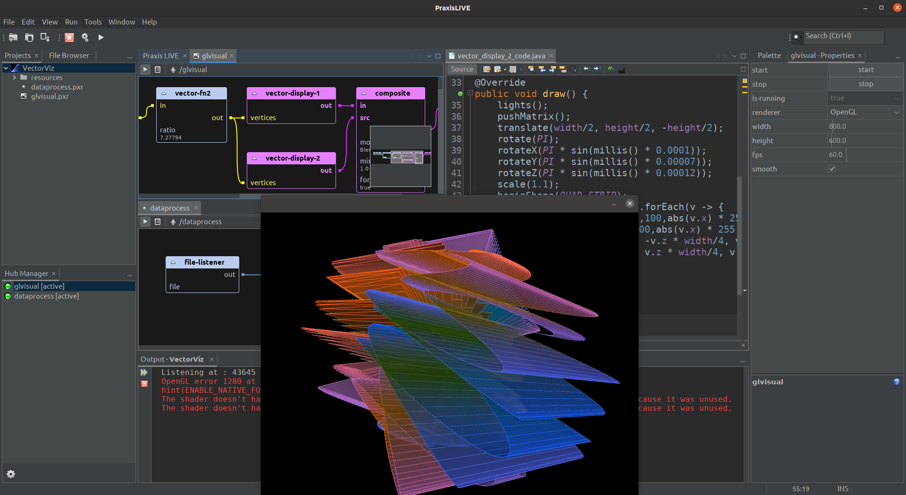

_rethinking general purpose and creative coding_

**PraxisLIVE** is a hybrid visual IDE for live programming - a nodes and code system providing the benefits of both
visual and textual coding, while aiming to counter some of the deficiencies of both. PraxisLIVE began as a
tool for creative coders, but has broadened to embrace more general purpose programming, while retaining access
to features for creatives.

**PraxisCORE** is at the heart of PraxisLIVE, a modular real-time recodeable actor system. It can be used via
PraxisLIVE, for exporting standalone projects, as a command line tool, or as individual libraries. Supporting
distributed processes and hot code reloading at all times, it brings aspects of Smalltalk, Erlang and Extempore
to the Java platform.

Download from [www.praxislive.org](http://www.praxislive.org)

All of PraxisLIVE is free and open-source. PraxisCORE is free to use in open-source and commercial projects.
Development is supported by [Codelerity Ltd.](https://www.codelerity.com), who can also provide commercial support
and custom development.

## Primary features

_...imagine combining the best of Java or Processing with the best of visual node-based systems like Node-RED;
imagine components defined as code fragments, so you're never constrained by what comes built-in;
imagine forking components or creating new ones **all while your project is running**..._

* **Real-time processing**. [Forest-of-actors](https://www.praxislive.org/blog/a-forest-of-actors/) architecture
for low-latency, data processing, media & embedded. Optional graphics module with support for
[Processing](https://processing.org/), [GStreamer](https://gstreamer.freedesktop.org/) and OpenGL. Optional audio
with [Pipes](http://jaudiolibs.org/) and [JACK](http://www.jackaudio.org/).
* **Intuitive graphical patching**. Node-based actor graph editing for fast visual project building. Drag & drop
components, draw in connections. _Edit everything live_ - instant feedback without interrupting flow.
* **Extend at runtime**. Fork components on-the-fly, or create new ones from scratch, _with real-time code reload_.
Integrated live Java editor and compiler. Export and share, or import from a growing library.
* **Distributed by Design**. Built from the ground up for working with multiple pipelines using a distributed
architecture. Option to run projects transparently across processes or machines.

## Contents

<h3>Getting started</h3>

* [Installation](installation.md)
* [Example projects](examples.md)
* [Architecture & terminology](architecture.md)
* [Main interface](main-interface.md)

<h3>Visual project building</h3>

* [Projects](projects.md)
* [Editors](editors.md)
* [Graph editor](editors-graph.md)
* [GUI control panel editor](editors-gui.md)
* [MIDI bindings editor](editors-midi.md)
* [OSC bindings editor](editors-osc.md)
* [Component editors](component-editors.md)
* [Custom components](custom-components.md)

<h3>Code editing</h3>

* [Coding in PraxisLIVE](coding.md)
* [Coding core components](coding-core.md)
* [Coding audio components](coding-audio.md)
* [Coding video components](coding-video.md)
* [Coding OpenGL video components](coding-video-gl.md)
* [Coding Tinkerforge components](coding-tinkerforge.md)
* [Properties & animation](coding-properties.md)
* [Annotations](coding-annotations.md)
* [Additional annotations](coding-annotations-extra.md)
* [Linkables](coding-linkables.md)
* [References](coding-ref.md)
* [Data Pipes](coding-data-pipes.md)

<h3>Built-in components</h3>

* [Core components](components-core.md)
* [Audio components](components-audio.md)
* [Video components](components-video.md)
* [GUI components](components-gui.md)

<h3>Advanced usage</h3>

* [Command line usage](cli-usage.md)

## Contact / support

Support is available through the [PraxisLIVE website](https://www.praxislive.org), and the 
[mailing list & chat](https://www.praxislive.org/community/).

Please report bugs or make features requests on the [issue tracker](https://github.com/praxis-live/support/issues)

