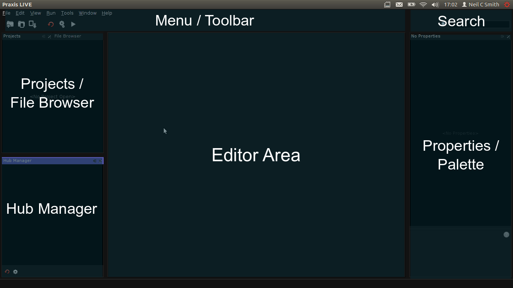

# Main interface

The image below outlines the default window layout. _PraxisLIVE_ uses a typical MDI interface, whereby components and documents being edited are encompassed within a single main window. It is possible to drag components around the interface or un-dock them into a separate window. Any changes you make will be persisted – if you want to reset to the default layout, use the `Window / Reset Windows` action in the main menu.

## Toolbar

Six common actions have buttons in the main toolbar.

* **New Project** 

   Start the new project wizard.

* **Open Project** 

   Open the project browser allowing you to open a pre-existing project. The project will open in the `Project` tab, but will not be run.

* **Save File** 

   Save the file currently being edited. **NB. it does not save the entire project.**

* **Restart Hub** 

   Restart the _PraxisLIVE_ hub. All installed root components will be removed - a dialog will be opened giving the option to save any associated files first.

* **Build Project** 

   Build the selected project. This will install any root components in the hub (so they can be edited), but will not run them (play audio, video, etc.)

* **Run Project** 

   Run the selected project. This will build the project (if necessary) and then start all roots set to run automatically.

## Projects / File browser

The `Projects` tab provides an interface for opening and managing projects. Projects are shown in a tree-like structure giving access to all the user-editable files that make up a _PraxisLIVE_ project.

The `File browser` tab provides a mechanism for browsing the local file system. It is particularly useful for dragging custom components into an editor.

## Hub manager

The `Hub Manager` tab provides an overview of the roots running within the _PraxisLIVE_ hub.

The LED icon to the left of the root ID shows whether a root is running or not. Individual roots can be started or stopped by double-clicking.

Individual roots may be removed from the hub by selecting `Delete` from the relevant popup menu. An option to save the current state of the root is provided before the root is removed.

There are two buttons at the bottom of the Hub Manager tab. The first duplicates the `Restart Hub` action from the main toolbar. The second provides the option to display system root components in the Hub Manager for debugging purposes.

## Properties / Palette

The `Properties` tab provides a way to view and edit the properties of the currently selected item, such as a file in the `Projects` tab or a component in the the editor.

The `Palette` shows the range of components that may be added to the root file currently being edited. The Palette tab will only show up when a relevant file is open for editing.

## Search / Help

The primary function of the `Search` box is to allow searching through documentation for all of the various components in the online help. Due to the continuous development of _PraxisLIVE_, individual components are not described here but within the program itself. The help files can also be accessed by pressing `F1`.

As well as help files, the Search box also allows searching for actions and settings.

Use `CTRL-I` to focus the Search box from the keyboard.

## Options / Settings

The `Options` window can be opened through the `Tools` menu in the main menu bar. It provides the ability to set common default settings such as video capture devices, audio devices, etc.

These settings can be overridden by individual component properties where required.

Settings are stored at a system level, so also apply to projects run from the command line or local slaves (though again this behaviour can be overridden). _Slaves running on remote machines will not use these settings._
