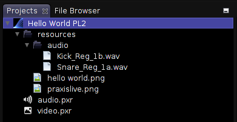
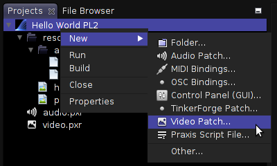

# Projects

The core praxis architecture is driven by its own simple scripting language. However, using _Praxis LIVE_ you don't need to know this as the project system allows you to build projects graphically.

_Praxis LIVE_ projects are actually folders. The configuration of each root in your project (video patch, audio patch, control panel, etc.) is stored in a separate script file. These files have the `.pxr` file extension.

The scripts that make up a _Praxis LIVE_ project are divided into **Build Level** files and **Run Level** files. It is important to remember that everything is edited live, so only components that are actually installed in the hub can be edited. For this reason, you can build a project to enable editing without needing to run it (start video / audio playback, etc.). As you develop a project, the system tracks which files have and haven't been executed, so that you can always build and/or run a project at any time.

It is possible to work with multiple projects concurrently, as long as there is no collision between root ID's – all root components installed within the hub at any one time must have a unique name.

The main project folder also contains a `resources` folder. It is recommended that you store all media required by your project in the resources folder, or a sub-folder of it. This allows for projects to be completely self contained and makes distributing them easier. The pop-up menu on resource folders provides an import action to copy media into your project. While it is currently possible to create `.pxr` files beneath the resources folder, _it is advised that you do not do this_.

If you look at a project folder in your file browser you will also see a range of configuration files that are normally hidden from view. Do not alter any of these. All files that define a project are
actually valid scripts, allowing for projects to also be run using the command line player. When running from the command line there is no distinction between build level and run level files.

## Project tab

The `Projects` tab gives you the tools for opening and managing projects. Projects are shown in a tree-like structure which shows you all the user-editable files that make up a _Praxis LIVE_ project.

Here you can see two of the example projects opened within the projects tab, with all folders expanded. Note the location of various `.pxr` files which define different roots (video patch, audio patch, control panel), as well as various audio and image resources.

To run a project, select it and use the buttons on the toolbar, or use the pop-up menu on the main project folder.

To stop and clear a running project, restart the hub - you will be given the option to save any changes. Unless you are using the (advanced) ability to work with multiple projects, _get into the habit of restarting the hub before trying to run another project._

Double-clicking a `.pxr` file will open it in an editor window, such as the graphical patcher for audio & video.

You can create a new `.pxr` file, such as an audio or video patch, from the project's pop-up menu. Selecting one of these options will open a wizard which will allow you to provide the root ID, which will also be used as the name of the file. Advanced options allow you to control whether the root will auto-start when the project is run, and whether to install the root immediately in the hub for editing. The default options will be correct in the vast majority of cases.

The `Properties` option in the project's pop-up menu will open the project configuration dialog. Within this you can control which files are included within the `Build` and `Run` stages of a project. You can use this to control which roots auto-start, or to temporarily ignore certain files without deleting them. You can also use this to fix the project configuration in rare cases where _Praxis LIVE_ terminates unexpectedly.
