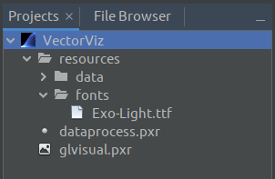
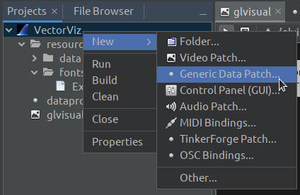

# Projects

The _PraxisCORE_ architecture is driven by its own simple scripting language -
Praxis Command Language (Pcl). However, using _PraxisLIVE_ you don't need to know this
as the project system allows you to build projects graphically.

_PraxisLIVE_ projects are folders. The configuration of each root in your
project (video patch, audio patch, control panel, etc.) is stored in a separate file.
These files have the `.pxr` file extension.

The scripts and other elements that make up a _PraxisLIVE_ project are divided into **Build Level** elements
and **Run Level** elements. It is important to remember that everything is edited live,
so only components that are actually installed in the hub can be edited. For this reason,
you can build a project to enable editing without needing to run it.
As you develop a project, the system tracks which elements have and haven't been executed,
so that you can always build and/or run a project at any time.

The main project folder also contains a `resources` folder. It is recommended that
you store all media required by your project in the resources folder, or a sub-folder
of it. This allows for projects to be completely self contained and makes distributing
them easier. The pop-up menu on resource folders provides the ability to import files or
open in the system file browser.

All files that define a project are Pcl scripts, allowing for projects
to also be run using the command line player or standalone harness. When running from
the command line or standalone there is no distinction between build level and
run level files.

## Project tab

The `Projects` tab gives you the tools for creating, opening and managing projects. Projects
are shown in a file view which shows you all the user-editable files.



Here you can see one of the example projects opened within the projects tab, with
all folders expanded. Note the location of `.pxr` files which define different roots,
as well as various resource files.

To run a project, select it and use the buttons on the toolbar, or use the pop-up
menu on the main project folder.

To stop and clean a running project, also use the toolbar button or pop-up menu. You will
be given the option to save any changes.

The `.pxr` files will open for editing automatically when a project is built or run. You
can also open these files manually.

You can create a new `.pxr` file, such as an audio or video patch, from the project's pop-up menu.
Selecting one of these options will open a wizard which will allow you to provide the root ID, which
will also be used as the name of the file. If the project isn't built, you will be given the option
to build it so that the file can be edited.



The `Properties` option in the project's pop-up menu will open the project configuration
dialog. You can use this to control the Build and Run elements of the project, as well
as configure libraries, hub configuration and Java settings.

## Hub configuration

Inside the project properties you will find support for configuring the hub, including control
of which roots run in local external processes or on a remote machine. The same settings will
apply when running the project within the IDE, and when running from the command line or
standalone.

The hub configuration is currently edited as text, as a nested map. It can only be edited
when the project isn't active, otherwise the text area will be read only. Clean the project
if necessary to edit. A full UI for hub configuration will be in a future IDE update.

The typical default project configuration will run audio and video roots in separate local processes.

```
enable-fileserver false
proxies {
  video {
    host localhost
    port auto
    id-pattern *
    type-pattern video
    exec {
      command default
      java-options {
        -XstartOnFirstThread
        -XX:+IgnoreUnrecognizedVMOptions
        -Djava.awt.headless=true
      }
    }
  }
  audio {
    host localhost
    port auto
    id-pattern *
    type-pattern audio
    exec {
      command default
    }
  }
}
```

Proxies must have unique names (eg. video, audio) although these are only used for informational
purposes. The id and type fields use glob patterns, including `*` and `|` to match against root
id and type, checked in the order they're specified. Host and port can be local or remote - a port
setting of `auto` can be only used where a child process is being launched.

An `exec` section, if specified, will auto-launch another process when required (unlike earlier
versions of _PraxisLIVE_, the child process support in _PraxisCORE_ is lazy). A command of
`default` means to create a new version of the existing process, with specified `java-options`.
Other commands and argument passing will be supported in a future update.

The file server can be enabled if using remote processes to serve resources to them. Note that
there is no authentication involved, so be careful with network security.

You can launch a _PraxisCORE_ process on another machine and connect to it over the network
from the IDE. To launch the child use the command line launcher -

```
praxis --network all --port 42424
```

See the [command line launcher documentation](cli-usage.md) for more information.

Assuming the above process is running on a machine at `192.168.0.42` the IDE set the project
configuration to this and build the project as normal -

```
enable-fileserver true
proxies {
  all {
    host 192.168.0.42
    port 42424
    id-pattern *
    type-pattern *
  }
}
```